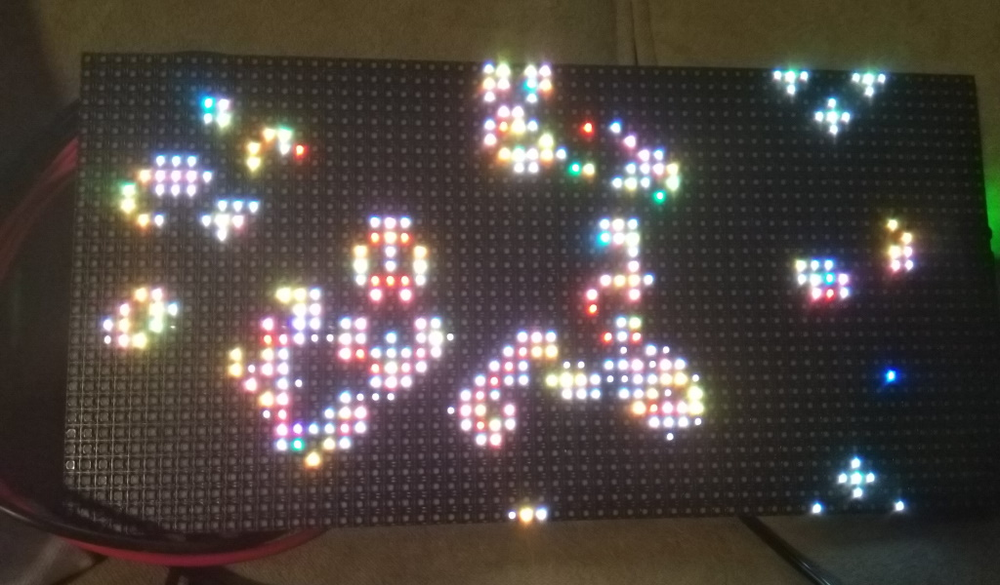
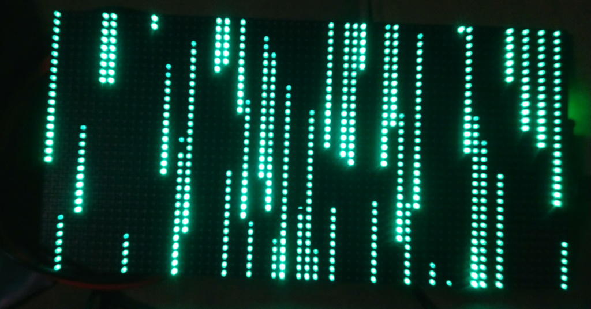
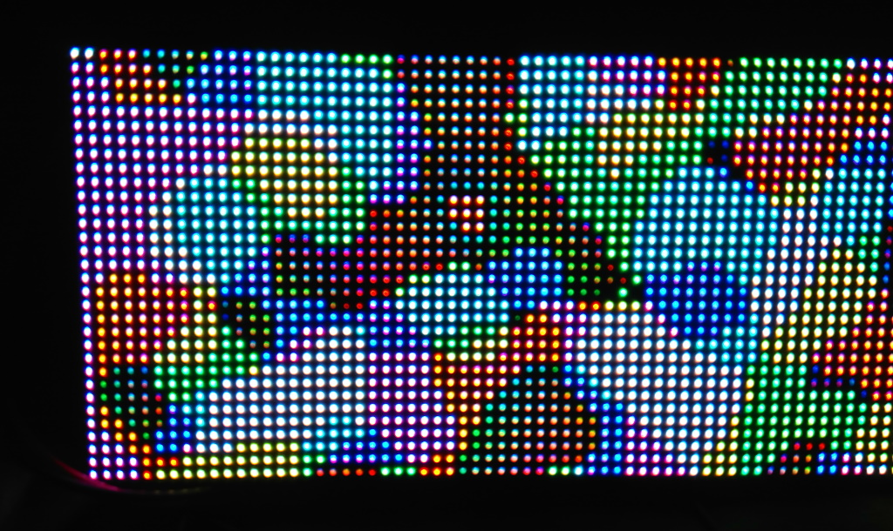
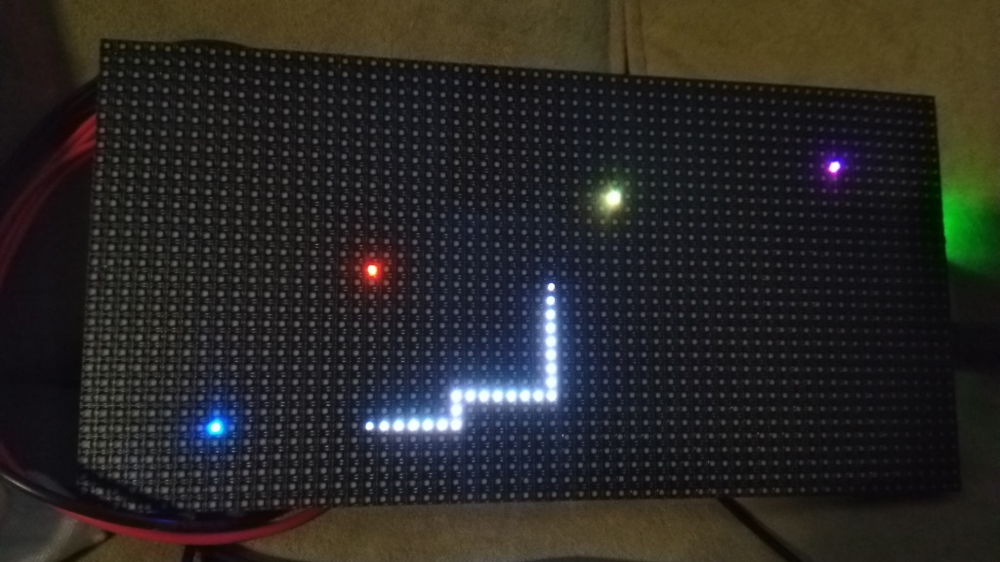

# Arduino Projects

Various experiments with Arduino UNO, Arduino Nano, NodeMCU, ESP32 C3 Super Mini, MatrixPortal S3.

All work in the Arduino IDE.

## Keywords

Arduino, Arduino Nano, Arduino UNO, ESP32, ESP32 C3 Super Mini, Adafruit, 
MatrixPortal S3, U8G2, KY006, OV7670, Plasma, Perlin noise, Adafruit Protomatter,
SSD1306, DHT11, 

## Projects

### blink-esp32

Simple LED blink for an ESP32 C3 Super Mini.

### blink-nano

Simple LED blink for an Arduino Nano.

### findprimes

Calculate the first X prime numbers.
Used to compare the speed of various boards.

### gol-matrixportal

Game Of Life for the MatrixPortal S3.

### i2c_scanner

Scan for i2c devices.

### ky006-esp32

Testing a KY006 passive buzzer.

### matrix-matrixportal

The 'Matrix' animation on the MatrixPortal S3.

### matrix-uno-r4

Testing the LED matrix on a Arduino Uno R4.

### oledtest-nano

Testing an I2C OLED display on an Arduino Nano. Uses the U8G2 library.

### ov7670-nano

Testing an OV7670 OLED display.

### pixeldust-matrixportal

Example from Adafruit.

### plasma-matrixportal

'Plasma' simulation on the MatrixPortal S3 using Perlin noise.

### rects-matrixportal

Draw random rectangles on the MatrixPortal S3.

### server-nodemcu

Simple webserver on a NodeMCU.

### snake-matrixportal

Random moving snake on the MatrixPortal S3.

### snake-uno-r4

Random moving snake on the LED matrix of an Arduino Uno R4.

### ssd1306-128-64-i2c-esp32

Experiment with an SSD1306 OLED display on an ESP32 C3 Super Mini.

### ssd1306-blink-esp32

Experiment with an SSD1306 OLED display on an ESP32 C3 Super Mini.

### ssd1306-photos-esp32

Display images on an SSD1306 OLED display with an ESP32 C3 Super Mini.

### tempdisplay-esp32

Display the temperature on an SSD1306 OLED display, using a DHT11 sensor.

### text-matrixportal

Show scrolling text on a MatrixPortal S3.

### tfttest1-nano

Testing a 1.8" ST7735 OLED display.

### tonemelody-esp32

Playing melodies with a ESP32 C3 Super Mini.

